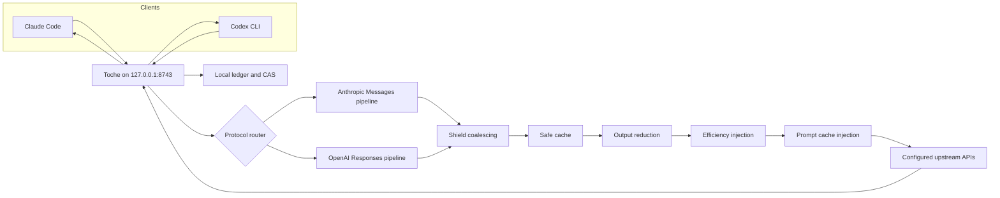

<p align="center">
  
</p>

<p align="center">
  <strong>One local runtime. Multiple AI clients. Every request leaves a receipt.</strong>
</p>

<p align="center">
  Toche is a local multi-client gateway that sits between your AI coding tools and
  their upstream API endpoints. It removes avoidable work, isolates trust boundaries,
  and keeps every optimization visible and reversible.
</p>

<p align="center">
  
</p>

<p align="center">
  <a href="#what-toche-is">What Toche is</a> ·
  <a href="#what-toche-is-not">What it is not</a> ·
  <a href="#install">Install</a> ·
  <a href="#how-it-works">How it works</a> ·
  <a href="#supported-clients">Supported clients</a> ·
  <a href="#command-reference">Commands</a> ·
  <a href="#trust-and-isolation">Trust and isolation</a> ·
  <a href="#documentation">Docs</a>
</p>

## What Toche is

Toche is a local runtime that accepts connections from multiple AI coding clients
simultaneously and routes their requests to your configured upstream API endpoints.
While a request passes through, Toche can:

- **Coalesce identical in-flight requests** so N clients sharing the same upstream
  and trust domain make one upstream call instead of N.
- **Replay eligible responses** from a persistent cross-session cache when the
  workspace fingerprint matches.
- **Reduce known tool-output noise** with 65 built-in TOML-defined filters
  while keeping the original content recoverable with `toche expand`.
- **Inject provider prompt-cache breakpoints** to maximize Anthropic cache hits.
- **Record every request** in a local SQLite ledger so `toche stats` can explain
  what happened.

Toche does not host an account, send telemetry, or require a cloud service.

## What Toche is not

Toche is not a provider account manager, a model load balancer, a protocol
translator, or a hosted API gateway. It does not select providers automatically
or fall back between them. It does not translate between Anthropic and OpenAI
protocols. These are explicit non-goals for the 1.1.0 release.

## Install

### Prerequisites

- Node.js 18 or newer for the npm installer.
- At least one supported AI coding client already installed and working.
- Windows x64, Linux x64, macOS Intel, or macOS Apple silicon.

Rust is not required when installing from npm.

### One-time setup

```shell
npm install -g @nzkbuild/toche
toche setup
toche
```

Then, in other terminals, run your clients normally:

```shell
claude
codex
```

`toche setup` detects your existing client configurations, imports your current
upstreams, and writes a local `config.toml`. It never silently sends a paid model
request. You can run it again later to review or modify your configuration.

### Managed mode (optional convenience)

Instead of starting the runtime separately, you can launch a client through Toche
in one step:

```shell
toche run claude -- --dangerously-skip-permissions
toche run codex
```

Managed mode uses the same runtime, configuration, protocol handling, trust
isolation, ledger, and optimization pipeline as persistent mode.

### Normal daily use

After setup, the routine is:

1. Run `toche` and leave it open.
2. Run your clients in other terminals.

### Clean uninstall

```shell
toche disconnect claude
toche disconnect codex
npm uninstall -g @nzkbuild/toche
```

<details>
<summary><strong>Build from source instead of npm</strong></summary>

You need Rust 1.86 or newer.

```shell
git clone https://github.com/nzkbuild/toche.git
cd toche
cargo build --release
```

The binary is `target/release/toche` (`.exe` on Windows).

</details>

## How it works



In plain language, your AI clients send their normal API requests to Toche on
`127.0.0.1:8743`. Toche then:

1. Routes the request through the correct protocol driver (Anthropic Messages
   or OpenAI Responses).
2. Gives the request a stable fingerprint.
3. Shares an already-running identical request (within the same trust domain)
   or checks for an eligible local replay.
4. Shortens supported tool output and keeps the original locally recoverable.
5. Applies the selected efficiency and provider prompt-cache policy.
6. Forwards any remaining work to your configured upstream API endpoint.
7. Records the outcome locally so `toche stats` can explain it.

The internal pipeline order is:

```text
protocol dispatch → fingerprint → shield → safe cache → reduce → efficiency → cache → forward → ledger
```

## Supported clients

| Client | Protocol | Persistent mode | Managed mode | Setup |
|--------|----------|-----------------|--------------|-------|
| Claude Code | Anthropic Messages | `toche` + `claude` | `toche run claude` | `toche setup` |
| Codex CLI | OpenAI Responses | `toche` + `codex` | `toche run codex` | `toche setup` |

Multiple instances of the same client are supported. Claude Code and Codex can
run simultaneously through the same Toche runtime.

### Persistent vs. managed mode

**Persistent mode** (`toche` in one terminal, client in another) is the primary
workflow. Start Toche once and launch as many clients as you need.

**Managed mode** (`toche run <client>`) is a convenience that starts Toche and
the client together. It uses the exact same pipeline as persistent mode.

## Trust and isolation

Different credential references never share cache entries or in-flight request
coalescing. If you configure a personal Anthropic API key and a work OpenAI key,
their traffic is isolated by trust domain — even if they happen to target the
same upstream URL.

Trust domains are derived from the combination of integration identity, upstream
identity, and credential reference. Raw credential values are never placed in
logs, IDs, hashes, database diagnostics, or receipts.

Attribution confidence is recorded honestly: Toche distinguishes between exact
process identity, client-reported identity, workspace-level identity, inference,
and unknown identity. It does not fabricate identity where it cannot be observed.

## Data storage

Everything lives in `~/.toche/` (overridable with `TOCHE_CONFIG_DIR`):

| Path | Purpose |
|------|---------|
| `config.toml` | Runtime configuration, integrations, upstreams, policies |
| `ledger.db` | SQLite ledger of every routed request |
| `cas/` | Content-addressed storage for reduced originals and cached responses |
| `runtime_id` | Persistent UUIDv7 runtime identity |

Toche never sends your data to a cloud account.

## Measurement confidence

Every value reported by `toche stats` is classified by how it was obtained:

| Confidence | Meaning |
|------------|---------|
| `measured` | Toche observed it directly |
| `provider-reported` | The upstream API reported it |
| `estimated` | Derived from available data (e.g. list-price estimate) |
| `configured` | Comes from your configuration |
| `unknown` | Could not be determined |

Missing prices do not become zero. Missing usage does not become fabricated
usage. Cost estimates are labelled as equivalent public list-price estimates,
not your actual billed cost.

## Command reference

### Primary commands

| Command | What it does |
|---------|-------------|
| `toche` | Start the runtime on `127.0.0.1:8743` |
| `toche setup` | Guided, rerunnable configuration |
| `toche setup --dry-run` | Preview changes without writing |
| `toche setup --force` | Regenerate configuration (backup created) |
| `toche connect [client]` | Route a client through Toche |
| `toche disconnect [client]` | Restore direct upstream routing |
| `toche run <client>` | Run a client in managed mode |
| `toche doctor` | Verify installation and configuration |
| `toche status` | Show runtime status, active flights, protocol counts |
| `toche status --json` | Machine-readable status |
| `toche stats` | Show usage, tokens, and cost estimates |
| `toche stats --json` | Machine-readable statistics |
| `toche stats --protocol anthropic` | Filter by protocol |
| `toche stats --integration <name>` | Filter by integration |
| `toche expand <hash>` | Restore original tool output from a reduction hash |

### Advanced commands

| Command | What it does |
|---------|-------------|
| `toche cache inspect` | List persistent safe-cache entries |
| `toche cache clear` | Clear entries for the current project |
| `toche cache clear --all` | Clear all persistent cache entries |
| `toche cache why <fingerprint>` | Explain the cache decision for a fingerprint |
| `toche checkpoint save` | Save a session checkpoint |
| `toche checkpoint list` | List saved checkpoints |
| `toche checkpoint show` | Show the latest checkpoint |
| `toche checkpoint delete <id>` | Delete a checkpoint |
| `toche graph query <question>` | Query the optional knowledge graph |
| `toche graph status` | Show graph node and edge counts |
| `toche graph extract` | Rebuild the knowledge graph |

### Per-request bypass headers

Set a header to `true` (case-insensitive) to skip a stage for one request.
The umbrella bypass takes precedence over individual bypasses.

| Header | Skips |
|--------|-------|
| `x-toche-bypass` | The complete optimization pipeline |
| `x-toche-bypass-shield` | Request coalescing |
| `x-toche-bypass-safe-cache` | Persistent cache lookup and storage |
| `x-toche-bypass-reduce` | Tool-output reduction |
| `x-toche-bypass-efficiency` | Efficiency instruction injection |
| `x-toche-bypass-cache` | Provider prompt-cache injection |

## Configuration

Toche stores its configuration in `~/.toche/config.toml`. Running `toche setup`
generates it from your existing client configurations.

<details>
<summary><strong>Example config.toml</strong></summary>

```toml
schema_version = 2

[runtime]
port = 8743
listen_address = "127.0.0.1"
request_timeout_ms = 300000

[defaults]
integration = "abc12345"

[[integrations]]
id = "abc12345"
name = "default"
upstream = "def67890"
policy = "pol11111"

[[upstreams]]
id = "def67890"
name = "Anthropic"
url = "https://api.anthropic.com"

[upstreams.auth]
secret_ref = { type = "environment", key = "ANTHROPIC_API_KEY" }
header_name = "x-api-key"

[upstreams.headers]
anthropic-version = "2023-06-01"

[[policies]]
id = "pol11111"
name = "default"

[policies.cache]
enabled = true
mode = "auto"
breakpoint = "standard"

[policies.reduce]
enabled = true

[policies.efficiency]
mode = "concise"

[policies.safe_cache]
enabled = true
ttl_days = 30
max_entry_bytes = 1048576
```

</details>

## Troubleshooting

<details>
<summary><strong>The runtime will not start</strong></summary>

- Check that nothing else is listening on port 8743.
- Run `toche doctor` to verify that `config.toml` exists and is valid.
- Enable debug logging with `RUST_LOG=toche=debug toche`.

</details>

<details>
<summary><strong>A client cannot connect</strong></summary>

- Start the runtime before running `toche connect`.
- Run `toche doctor` in a second terminal after connecting.
- Check that `toche status` shows the expected integrations.

</details>

<details>
<summary><strong>Stats or cache entries are empty</strong></summary>

- The ledger records only requests routed through the runtime.
- The persistent cache stores only eligible text-only responses without `tool_use` blocks.
- Use `toche cache why <fingerprint>` to inspect a cache rejection.

</details>

<details>
<summary><strong>Routing still points to Toche after disconnecting</strong></summary>

Run `toche doctor`. If environment variables or settings still reference Toche
while the runtime is stopped, run `toche disconnect` for each affected client.

</details>

## Upgrading from 1.0.x

Toche 1.1.0 migrates your existing `profiles.toml` to the new `config.toml`
format automatically on first load. The migration:

- Converts each profile into separate Integration, Upstream, and Policy entries.
- Backs up `profiles.toml` to `profiles.toml.v1.bak`.
- Preserves your ledger, safe-cache metadata, CAS, checkpoints, and Graphify data.
- Is idempotent — running it again is a no-op.
- Fails safely on malformed configuration without modifying anything.

An older binary encountering a newer schema version will refuse to modify it.

## Requirements

- Rust 1.86 or newer (edition 2024) when building from source
- At least one supported AI coding client
- No hosted Toche service
- SQLite is bundled through `rusqlite`

## Documentation

- [Architecture](docs/ARCHITECTURE.md): system design, crate map, data flow, decision records
- [Changelog](CHANGELOG.md): release history from 1.0.0 through 1.1.0
- [Contributing](CONTRIBUTING.md): setup, conventions, and PR workflow
- [Code of Conduct](CODE_OF_CONDUCT.md): Contributor Covenant
- [Bug tracker](docs/BUG_TRACKER.md): issues found and fixed during dogfooding
- [npm publishing](docs/NPM_PUBLISHING.md): maintainer checklist for npm releases
- [Third-party notices](THIRD_PARTY_NOTICES.md): reused ideas, integration decisions, and attribution

## Built from good work

Toche's Rust implementation was informed by ideas and patterns from ccusage, RTK,
Graphify, andrej-karpathy-skills, and caveman-claude. Their licenses and attribution
are preserved in [THIRD_PARTY_NOTICES.md](THIRD_PARTY_NOTICES.md).

## License

Licensed under the [Apache License 2.0](LICENSE).
