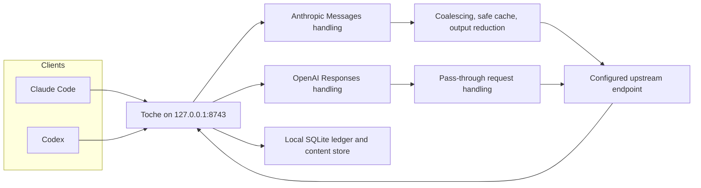

<p align="center">
  
</p>

# Make local AI coding work less repetitive

Toche is a local efficiency runtime for Claude Code and Codex. It sits between those coding clients and your existing API providers, then removes duplicate work, reduces noisy tool output, reuses eligible responses, and records every result locally.

**1 local runtime · 2 supported clients · 2 supported API protocols · 65 built-in output filters · eligible identical in-flight requests: N upstream calls to 1 · 0 hosted accounts · no telemetry**

```shell
npm install -g @nzkbuild/toche
toche setup
toche
```

Then run `claude` or `codex` in another terminal.

<p align="center">
  
</p>

<p align="center">
  <a href="#why-use-toche">Why use Toche</a> ·
  <a href="#install">Install</a> ·
  <a href="#use-cases">Use cases</a> ·
  <a href="#how-it-works">How it works</a> ·
  <a href="#supported-clients">Supported clients</a> ·
  <a href="#trust-and-measurement">Trust and measurement</a> ·
  <a href="#commands">Commands</a> ·
  <a href="#technical-documentation">Technical documentation</a>
</p>

## Why use Toche

Coding agents often repeat requests, return large tool outputs, and spread usage records across separate client sessions. Toche gives supported clients one local runtime that can share eligible in-flight work, filter known noisy output, reuse eligible local responses, and keep a local ledger of what happened.

| Without Toche | With Toche |
|---|---|
| Each client sends its own matching request upstream. | Eligible identical in-flight requests in the same trust domain are coalesced from N upstream calls to 1. |
| Long tool output reaches the client unchanged. | 65 built-in filters can reduce supported noisy output. Original content remains locally recoverable with `toche expand`. |
| Claude Code and Codex usage is separate. | One local SQLite ledger records requests from both supported clients. |
| A repeated eligible response requires another upstream call. | The safe cache can replay eligible text-only responses when the workspace fingerprint matches. |
| Client configuration and upstream behavior are harder to inspect together. | `toche status`, `toche stats`, and `toche cache why` expose local runtime decisions. |

Toche is not a normal proxy. It does not choose providers, manage provider accounts, translate one protocol into another, load balance traffic, or support every AI client. It preserves the request protocol used by each supported client and forwards remaining work to the upstream API endpoint you configure.

## Install

### Prerequisites

- Node.js 18 or newer for the npm installer
- Claude Code or Codex already installed and working
- Windows x64, Linux x64, macOS Intel, or macOS Apple silicon

Rust is not required when installing from npm.

### Start the local runtime

```shell
npm install -g @nzkbuild/toche
toche setup
toche
```

In another terminal, run a supported client normally:

```shell
claude
codex
```

`toche setup` detects supported client configurations, imports your current upstream settings, and writes a local `config.toml`. You can run it again later to review or change the local configuration.

### Managed mode

Managed mode starts Toche and one client together:

```shell
toche run claude -- --dangerously-skip-permissions
toche run codex
```

### Build from source

Rust 1.86 or newer is required.

```shell
git clone https://github.com/nzkbuild/toche.git
cd toche
cargo build --release
```

The binary is `target/release/toche` (`.exe` on Windows).

## Use cases

### Multiple simultaneous coding agents

Run Claude Code and Codex at the same time through one local runtime. Eligible identical non-streaming Anthropic Messages requests in the same trust domain share one upstream call while waiters receive the captured result.

### Long-running and cross-session work

The local ledger records routed requests. The safe cache can reuse eligible text-only responses across sessions when the project and workspace fingerprint match.

### Tool-output reduction

Toche applies 65 built-in TOML-defined filters to supported tool output. The reduced result reaches the client while the original stays locally recoverable through `toche expand <hash>`.

### Unified Claude Code and Codex usage visibility

`toche stats` and `toche status` read one local ledger for both supported clients. Measurement confidence labels distinguish observed, provider-reported, estimated, configured, and unknown values.

### Existing Anthropic Messages and OpenAI Responses compatible providers

Configure existing upstream endpoints that speak either supported protocol. Toche handles Anthropic Messages for Claude Code and OpenAI Responses for Codex without translating between protocols.

### Local and privacy-conscious workflows

Toche runs on `127.0.0.1:8743`, uses local files under `~/.toche/`, requires 0 hosted accounts, and sends no telemetry.

## How it works



For an Anthropic Messages request, Toche:

1. Identifies the configured integration and trust domain.
2. Computes a request fingerprint.
3. Coalesces an eligible matching in-flight request or checks the local safe cache.
4. Reduces supported tool output and retains the original locally.
5. Applies configured efficiency and provider prompt-cache policies.
6. Forwards remaining work to the configured upstream endpoint.
7. Records the outcome in the local ledger.

OpenAI Responses requests are forwarded through their own supported protocol path and recorded in the same local ledger. They are not translated into Anthropic Messages requests.

## Supported clients

| Client | API protocol | Persistent mode | Managed mode |
|---|---|---|---|
| Claude Code | Anthropic Messages | `toche` then `claude` | `toche run claude` |
| Codex | OpenAI Responses | `toche` then `codex` | `toche run codex` |

Multiple instances of either supported client can use the same Toche runtime.

## Trust and measurement

### Trust isolation

Different credential references do not share cache entries or in-flight coalescing. Toche derives a trust domain from integration, upstream, and credential-reference identity. Raw credential values are not placed in logs, IDs, hashes, database diagnostics, or receipts.

### Local data

Everything lives in `~/.toche/` unless `TOCHE_CONFIG_DIR` overrides it.

| Path | Purpose |
|---|---|
| `config.toml` | Runtime configuration, integrations, upstreams, and policies |
| `ledger.db` | SQLite ledger of routed requests |
| `cas/` | Original reduced output and eligible cached responses |
| `runtime_id` | Persistent runtime identity |

### Measurement confidence

| Confidence | Meaning |
|---|---|
| `measured` | Toche observed the value directly |
| `provider-reported` | The upstream API returned the value |
| `estimated` | Toche derived the value from available data |
| `configured` | The value came from local configuration |
| `unknown` | The value could not be determined |

Missing prices do not become zero. Missing usage does not become fabricated usage.

## Commands

| Command | What it does |
|---|---|
| `toche` | Start the local runtime on `127.0.0.1:8743` |
| `toche setup` | Create or update local configuration |
| `toche connect [client]` | Configure a supported client to use Toche |
| `toche disconnect [client]` | Restore direct upstream configuration |
| `toche run <client>` | Start Toche and a supported client together |
| `toche doctor` | Check installation and configuration |
| `toche status` | Show runtime state, active flights, and protocol counts |
| `toche stats` | Show local usage, tokens, and cost estimates |
| `toche cache inspect` | List local safe-cache entries |
| `toche cache why <fingerprint>` | Explain a cache decision |
| `toche expand <hash>` | Recover original tool output from a reduction hash |
| `toche checkpoint save` | Save a local session checkpoint |

### Per-request bypass headers

Set a header to `true` to skip a stage for one request.

| Header | Skips |
|---|---|
| `x-toche-bypass` | The complete optimization pipeline |
| `x-toche-bypass-shield` | Request coalescing |
| `x-toche-bypass-safe-cache` | Persistent cache lookup and storage |
| `x-toche-bypass-reduce` | Tool-output reduction |
| `x-toche-bypass-efficiency` | Efficiency instruction injection |
| `x-toche-bypass-cache` | Provider prompt-cache injection |

## Configuration

Toche stores configuration in `~/.toche/config.toml`. `toche setup` builds it from detected supported-client configuration.

<details>
<summary><strong>Example config.toml</strong></summary>

```toml
schema_version = 2

[runtime]
port = 8743
listen_address = "127.0.0.1"
request_timeout_ms = 300000

[defaults]
integration = "abc12345"

[[integrations]]
id = "abc12345"
name = "default"
upstream = "def67890"
policy = "pol11111"

[[upstreams]]
id = "def67890"
name = "Anthropic"
url = "https://api.anthropic.com"

[upstreams.auth]
secret_ref = { type = "environment", key = "ANTHROPIC_API_KEY" }
header_name = "x-api-key"

[upstreams.headers]
anthropic-version = "2023-06-01"

[[policies]]
id = "pol11111"
name = "default"

[policies.reduce]
enabled = true

[policies.safe_cache]
enabled = true
ttl_days = 30
max_entry_bytes = 1048576
```

</details>

## Technical documentation

- [Architecture](docs/ARCHITECTURE.md): system design, crate map, data flow, and decisions
- [Changelog](CHANGELOG.md): release history through 1.1.1
- [Contributing](CONTRIBUTING.md): setup, conventions, and PR workflow
- [Bug tracker](docs/BUG_TRACKER.md): documented dogfooding findings
- [npm publishing](docs/NPM_PUBLISHING.md): maintainer checklist
- [Third-party notices](THIRD_PARTY_NOTICES.md): attribution and reused ideas

## Troubleshooting

- Run `toche doctor` to check local configuration and supported client connections.
- Run `toche status` to inspect the runtime.
- Use `toche cache why <fingerprint>` when an eligible response was not reused.
- Run `toche disconnect claude` or `toche disconnect codex` to restore direct client configuration.

## License

Licensed under the [Apache License 2.0](LICENSE).
