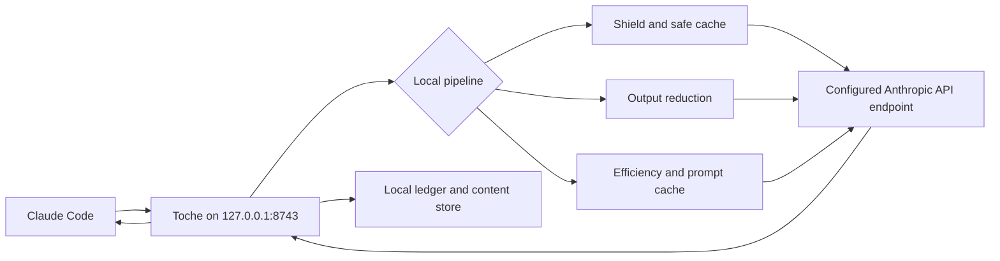

<p align="center">
  
</p>

<p align="center">
  <strong>Spend less context on noise. Keep more of the work.</strong>
</p>

<p align="center">
  A local efficiency gateway for Claude Code that helps avoid repeated API work,
  trims noisy tool output, coordinates caching, and shows where the tokens went.
</p>

| Version | Built with | Works with | Runs as | License |
|:-------:|:----------:|:----------:|:-------:|:-------:|
| **1.0.6** | **Rust** | **Claude Code** | **Local gateway** | **Apache-2.0** |

<p align="center">
  <a href="#why-toche">Why Toche</a> ·
  <a href="#what-it-does">What it does</a> ·
  <a href="#quick-start">Quick start</a> ·
  <a href="#how-it-works">How it works</a> ·
  <a href="#command-reference">Commands</a> ·
  <a href="#safety-and-control">Safety</a> ·
  <a href="#documentation">Docs</a>
</p>

## Why Toche

Claude Code can do excellent work while quietly accumulating duplicate requests,
large command output, and context that stopped being useful several thousand tokens
ago. Toche sits between Claude Code and your configured Anthropic API endpoint and
handles that housekeeping locally.

There is no hosted Toche service and no second dashboard asking you to create an
account. You run the gateway, you choose the optimizations, and you can turn them
off when you want the raw path.

## What it does

| | Outcome | How Toche helps |
|---|---|---|
| **Avoid repeated work** | Fewer duplicate upstream calls | Identical in-flight requests share one response. Eligible text-only responses can also be replayed from a workspace-aware persistent cache. |
| **Keep context cleaner** | Less command noise in the conversation | Built-in filters trim known noise from Cargo, Git, test runners, linters, package managers, Docker, and other tools. Original output remains recoverable. |
| **Use provider caching deliberately** | Less manual cache plumbing | Toche detects prompt-cache breakpoints, supports observe mode, and can inject `cache_control` automatically. |
| **Understand usage** | A local record of what happened | The SQLite ledger records token counts, cache activity, coalescing, reduction savings, latency, and estimated cost. |
| **Resume with less friction** | Useful state survives a fresh session | Checkpoints preserve goals, completed work, next steps, changed files, and verification notes. |
| **Stay in control** | Optimizations are inspectable and reversible | Bypass headers, cache inspection, output recovery, `doctor`, and `disconnect` keep the machinery visible. |

Toche also includes `concise` and `careful` efficiency profiles and an optional
Graphify adapter for local project-graph queries.

## Quick start

Toche currently builds from source. You need Rust 1.85 or newer and Claude Code.

### Windows PowerShell

```powershell
git clone https://github.com/nzkbuild/toche.git
cd toche
cargo build --release

# Import your existing Claude Code configuration
.\target\release\toche.exe setup

# Start the gateway and leave this terminal open
.\target\release\toche.exe
```

Open a second PowerShell window in the repository:

```powershell
.\target\release\toche.exe connect
.\target\release\toche.exe doctor
```

Use Claude Code normally. When you want to return to direct upstream routing:

```powershell
.\target\release\toche.exe disconnect
```

### Linux or macOS

```bash
git clone https://github.com/nzkbuild/toche.git
cd toche
cargo build --release

# Import your existing Claude Code configuration
./target/release/toche setup

# Start the gateway and leave this terminal open
./target/release/toche
```

Open a second terminal in the repository:

```bash
./target/release/toche connect
./target/release/toche doctor
```

Use Claude Code normally. To restore direct upstream routing:

```bash
./target/release/toche disconnect
```

## How it works



At request level, the pipeline is:

```text
fingerprint -> shield -> safe cache -> reduce -> efficiency -> cache -> forward -> ledger
```

Toche fingerprints the canonical request, checks whether work can be safely shared
or replayed, reduces known tool-output noise, applies the selected efficiency and
prompt-cache policy, forwards the resulting request upstream, then records the
outcome locally.

For the module map, database schema, cache rules, and content-addressed storage
layout, see [the architecture guide](docs/ARCHITECTURE.md).

## Safety and control

- The gateway binds to `127.0.0.1:8743` by default.
- Toche configuration, its ledger, cache metadata, checkpoints, and stored content live locally.
- Requests that require upstream work still go to the Anthropic API endpoint configured in your profile.
- Persistent replay is limited to eligible responses. Responses containing `tool_use` blocks are rejected.
- `toche doctor` reports configuration and integration health.
- Every optimization stage has an explicit bypass header.
- `toche expand <hash>` restores original tool output after reduction.
- Cache entries can be inspected, explained, and cleared.
- `toche disconnect` restores direct Claude Code routing.

These controls make Toche inspectable and reversible. They are not a promise that
every request will be cheaper or that an optimization can never affect model behavior.

## Command reference

<details>
<summary><strong>Gateway, setup, and diagnostics</strong></summary>

| Command | What it does |
|---|---|
| `toche` | Start the gateway on `127.0.0.1:8743` |
| `toche setup` | Generate `profiles.toml` from Claude Code configuration |
| `toche setup --force` | Regenerate the profile and back up the existing file |
| `toche connect` | Route Claude Code through Toche |
| `toche disconnect` | Restore direct upstream routing |
| `toche doctor` | Show configuration and integration health |
| `toche status` | Show gateway status |

</details>

<details>
<summary><strong>Usage, reduction, and persistent cache</strong></summary>

| Command | What it does |
|---|---|
| `toche stats` | Show a human-readable usage and cost breakdown |
| `toche stats --json` | Print machine-readable statistics |
| `toche stats --entries 100` | Include the last 100 ledger entries |
| `toche expand <hash>` | Restore original tool output from a reduction hash |
| `toche cache inspect` | List persistent safe-cache entries |
| `toche cache clear` | Clear entries for the current project |
| `toche cache clear --all` | Clear all persistent cache entries |
| `toche cache why <fingerprint>` | Explain the cache decision for a fingerprint |

</details>

<details>
<summary><strong>Continuity and project graph</strong></summary>

| Command | What it does |
|---|---|
| `toche checkpoint save` | Save a session checkpoint |
| `toche checkpoint list` | List saved checkpoints |
| `toche checkpoint show` | Show the latest checkpoint |
| `toche checkpoint delete <id>` | Delete a checkpoint |
| `toche graph query <question>` | Query the optional knowledge graph |
| `toche graph status` | Show graph node and edge counts |
| `toche graph extract` | Rebuild the knowledge graph |

</details>

### Per-request bypasses

Set a header to `true`, case-insensitively, to skip a stage for one request.
The umbrella bypass takes precedence over individual bypasses.

| Header | Skips |
|---|---|
| `x-toche-bypass` | The complete optimization pipeline |
| `x-toche-bypass-shield` | Request coalescing |
| `x-toche-bypass-safe-cache` | Persistent cache lookup and storage |
| `x-toche-bypass-reduce` | Tool-output reduction |
| `x-toche-bypass-efficiency` | Efficiency instruction injection |
| `x-toche-bypass-cache` | Provider prompt-cache injection |

## Configuration

Profiles live in `~/.toche/profiles.toml`. Running `toche setup` generates a
profile from your existing Claude Code configuration.

<details>
<summary><strong>Example profile</strong></summary>

```toml
default = "default"

[[profiles]]
name = "default"
upstream_url = "https://api.anthropic.com"
auth_method = { type = "api_key", header_name = "x-api-key", key = "YOUR_ANTHROPIC_API_KEY" }

[profiles.cache]
enabled = true
mode = "auto"
breakpoint = "standard"

[profiles.reduce]
enabled = true

[profiles.efficiency]
mode = "concise"

[profiles.safe_cache]
enabled = true
ttl_days = 30
max_entry_bytes = 1048576

[profiles.graphify]
enabled = false
```

</details>

Set `TOCHE_CONFIG_DIR` to override the default `~/.toche/` directory.

## Troubleshooting

<details>
<summary><strong>The gateway will not start</strong></summary>

- Check that nothing else is listening on port 8743.
- Run `toche doctor` to verify that `profiles.toml` exists and is valid.
- Enable debug logging with `RUST_LOG=toche=debug toche`.

</details>

<details>
<summary><strong>Claude Code cannot connect</strong></summary>

- Start the gateway before running `toche connect`.
- Run `toche doctor` in a second terminal after connecting.

</details>

<details>
<summary><strong>Stats or cache entries are empty</strong></summary>

- The ledger records only requests routed through the gateway.
- The persistent cache stores only eligible text-only responses without `tool_use` blocks.
- Use `toche cache why <fingerprint>` to inspect a cache rejection.

</details>

<details>
<summary><strong>Routing still points to Toche after disconnecting</strong></summary>

Run `toche doctor`. If `env.ANTHROPIC_BASE_URL` still points to Toche while the
gateway is stopped, inspect `~/.claude/settings.json` and its Toche backup.

</details>

## Requirements

- Rust 1.85 or newer, edition 2024
- Claude Code or another Anthropic Messages API client
- No hosted Toche service
- SQLite is bundled through `rusqlite`

## Documentation

- [Architecture](docs/ARCHITECTURE.md): pipeline, modules, databases, and storage
- [Changelog](CHANGELOG.md): release history from 0.1.0 through 1.0.6
- [Bug tracker](docs/BUG_TRACKER.md): issues found and fixed during dogfooding
- [Third-party notices](THIRD_PARTY_NOTICES.md): reused ideas, integration decisions, and attribution

## Built from good work

Toche's Rust implementation was informed by ideas and patterns from ccusage, RTK,
Graphify, andrej-karpathy-skills, and caveman-claude. Their licenses and attribution
are preserved in [THIRD_PARTY_NOTICES.md](THIRD_PARTY_NOTICES.md).

## License

Licensed under the [Apache License 2.0](LICENSE).
