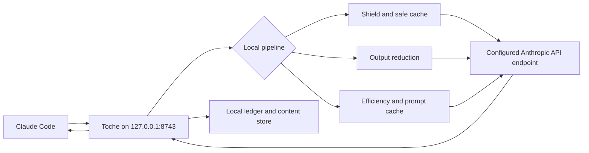

<p align="center">
  
</p>

<p align="center">
  <strong>Claude Code repeats less, carries less noise, and leaves you a receipt.</strong>
</p>

<p align="center">
  Toche is a local gateway between Claude Code and your Anthropic API endpoint.
  It removes avoidable work while keeping every optimization visible and reversible.
</p>

<p align="center">
  
</p>

<p align="center">
  <a href="#why-toche">Why Toche</a> ·
  <a href="#what-changes">What changes</a> ·
  <a href="#install">Install</a> ·
  <a href="#how-it-works">How it works</a> ·
  <a href="#command-reference">Commands</a> ·
  <a href="#safety-and-control">Safety</a> ·
  <a href="#documentation">Docs</a>
</p>

## Why Toche

Claude Code sessions often pay for the same kind of waste more than once: an
identical request is already running, a safe response was just fetched, or a tool
prints thousands of tokens when the useful result is a few lines. Toche handles
those cases before they consume another upstream call or more conversation space.

The useful part is not a universal marketing percentage. Toche measures your
actual traffic and reports what happened with `toche stats`.

## What changes

- **Three identical requests at the same time can become one upstream call.** The
  first request runs while the other two wait for and share its response.
- **An eligible local replay becomes zero new upstream calls.** Toche only replays
  workspace-matched, text-only responses that pass its safety checks.
- **Sixty-five command filters remove known noise.** Cargo, Git, Terraform, Helm,
  Ansible, linters, and other supported output can be shortened while the original
  remains recoverable with `toche expand`.
- **Every routed request leaves a local record.** Token counts, estimated cost,
  latency, cache decisions, coalescing, and reduction are written to a local SQLite
  ledger instead of a Toche cloud account.

Here is a deliberately simple example. If a supported tool prints an estimated
10,000 tokens and its useful reduced form is 3,000, the ledger records 7,000 tokens
removed, or 70%. That explains the measurement. It does not promise that every
command, repository, or session will save 70%.

Toche is most useful during long coding sessions, repeated test and diff cycles,
parallel agent work, and projects where you want to inspect the cost of the work.
A short conversation with no repetition or noisy tools may show little difference.

## Install

### Before you start

You need:

1. Claude Code installed and already working.
2. Node.js 18 or newer for the npm installer.
3. Windows x64, Linux x64, macOS Intel, or macOS Apple silicon.

Rust is not required when installing from npm.

### One-time setup

1. Install Toche globally. This makes the `toche` command available anywhere.

   ```shell
   npm install -g @nzkbuild/toche
   ```

2. Import your existing Claude Code endpoint into a local Toche profile.

   ```shell
   toche setup
   ```

3. Start Toche and leave this terminal open while using Claude Code.

   ```shell
   toche
   ```

4. Open a second terminal, connect Claude Code, and verify the setup.

   ```shell
   toche connect
   toche doctor
   ```

5. Start Claude Code normally.

   ```shell
   claude
   ```

`toche connect` creates a backup before changing Claude Code's local routing.

### Normal daily use

After the one-time setup, the routine is only:

1. Run `toche` and leave it open.
2. Run `claude` in another terminal.

You do not need to run `setup` again. You also do not need to run `connect` again
unless you previously used `toche disconnect`.

### Use these only when needed

| Command | When to use it |
|---|---|
| `toche stats` | You want to see requests, tokens, estimated cost, and measured savings |
| `toche doctor` | Something is not connecting or you want a health check |
| `toche disconnect` | You want Claude Code to bypass Toche and use its original endpoint |
| `toche setup --force` | You intentionally want to replace the current Toche profile; a backup is created |

To uninstall cleanly, restore Claude Code's original route first:

```shell
toche disconnect
npm uninstall -g @nzkbuild/toche
```

<details>
<summary><strong>Build from source instead of npm</strong></summary>

You need Rust 1.86 or newer.

```shell
git clone https://github.com/nzkbuild/toche.git
cd toche
cargo build --release
```

The binary is `target/release/toche` on Linux and macOS or
`target\release\toche.exe` on Windows. Run that binary with the same numbered setup
steps above.

</details>

## How it works



In plain language, Claude Code sends its normal Anthropic Messages API request to
Toche on `127.0.0.1:8743`. Toche then:

1. Gives the request a stable fingerprint.
2. Shares an already-running identical request or checks for an eligible local replay.
3. Shortens supported tool output and keeps the original locally recoverable.
4. Applies the selected efficiency and provider prompt-cache policy.
5. Forwards any remaining work to your configured Anthropic API endpoint.
6. Records the outcome locally so `toche stats` can explain it.

The exact internal order is:

```text
fingerprint -> shield -> safe cache -> reduce -> efficiency -> cache -> forward -> ledger
```

Toche fingerprints the canonical request, checks whether work can be safely shared
or replayed, reduces known tool-output noise, applies the selected efficiency and
prompt-cache policy, forwards the resulting request upstream, then records the
outcome locally.

For the module map, database schema, cache rules, and content-addressed storage
layout, see [the architecture guide](docs/ARCHITECTURE.md).

## Safety and control

- The gateway binds to `127.0.0.1:8743` by default.
- Toche configuration, its ledger, cache metadata, checkpoints, and stored content live locally.
- Requests that require upstream work still go to the Anthropic API endpoint configured in your profile.
- Persistent replay is limited to eligible responses. Responses containing `tool_use` blocks are rejected.
- `toche doctor` reports configuration and integration health.
- Every optimization stage has an explicit bypass header.
- `toche expand <hash>` restores original tool output after reduction.
- Cache entries can be inspected, explained, and cleared.
- `toche disconnect` restores direct Claude Code routing.

These controls make Toche inspectable and reversible. They are not a promise that
every request will be cheaper or that an optimization can never affect model behavior.

## Command reference

<details>
<summary><strong>Gateway, setup, and diagnostics</strong></summary>

| Command | What it does |
|---|---|
| `toche` | Start the gateway on `127.0.0.1:8743` |
| `toche setup` | Generate `profiles.toml` from Claude Code configuration |
| `toche setup --force` | Regenerate the profile and back up the existing file |
| `toche connect` | Route Claude Code through Toche |
| `toche disconnect` | Restore direct upstream routing |
| `toche doctor` | Show configuration and integration health |
| `toche status` | Show gateway status |

</details>

<details>
<summary><strong>Usage, reduction, and persistent cache</strong></summary>

| Command | What it does |
|---|---|
| `toche stats` | Show a human-readable usage and cost breakdown |
| `toche stats --json` | Print machine-readable statistics |
| `toche stats --entries 100` | Include the last 100 ledger entries |
| `toche expand <hash>` | Restore original tool output from a reduction hash |
| `toche cache inspect` | List persistent safe-cache entries |
| `toche cache clear` | Clear entries for the current project |
| `toche cache clear --all` | Clear all persistent cache entries |
| `toche cache why <fingerprint>` | Explain the cache decision for a fingerprint |

</details>

<details>
<summary><strong>Continuity and project graph</strong></summary>

| Command | What it does |
|---|---|
| `toche checkpoint save` | Save a session checkpoint |
| `toche checkpoint list` | List saved checkpoints |
| `toche checkpoint show` | Show the latest checkpoint |
| `toche checkpoint delete <id>` | Delete a checkpoint |
| `toche graph query <question>` | Query the optional knowledge graph |
| `toche graph status` | Show graph node and edge counts |
| `toche graph extract` | Rebuild the knowledge graph |

</details>

### Per-request bypasses

Set a header to `true`, case-insensitively, to skip a stage for one request.
The umbrella bypass takes precedence over individual bypasses.

| Header | Skips |
|---|---|
| `x-toche-bypass` | The complete optimization pipeline |
| `x-toche-bypass-shield` | Request coalescing |
| `x-toche-bypass-safe-cache` | Persistent cache lookup and storage |
| `x-toche-bypass-reduce` | Tool-output reduction |
| `x-toche-bypass-efficiency` | Efficiency instruction injection |
| `x-toche-bypass-cache` | Provider prompt-cache injection |

## Configuration

Profiles live in `~/.toche/profiles.toml`. Running `toche setup` generates a
profile from your existing Claude Code configuration.

<details>
<summary><strong>Example profile</strong></summary>

```toml
default = "default"

[[profiles]]
name = "default"
upstream_url = "https://api.anthropic.com"
auth_method = { type = "api_key", header_name = "x-api-key", key = "YOUR_ANTHROPIC_API_KEY" }

[profiles.cache]
enabled = true
mode = "auto"
breakpoint = "standard"

[profiles.reduce]
enabled = true

[profiles.efficiency]
mode = "concise"

[profiles.safe_cache]
enabled = true
ttl_days = 30
max_entry_bytes = 1048576

[profiles.graphify]
enabled = false
```

</details>

Set `TOCHE_CONFIG_DIR` to override the default `~/.toche/` directory.

## Troubleshooting

<details>
<summary><strong>The gateway will not start</strong></summary>

- Check that nothing else is listening on port 8743.
- Run `toche doctor` to verify that `profiles.toml` exists and is valid.
- Enable debug logging with `RUST_LOG=toche=debug toche`.

</details>

<details>
<summary><strong>Claude Code cannot connect</strong></summary>

- Start the gateway before running `toche connect`.
- Run `toche doctor` in a second terminal after connecting.

</details>

<details>
<summary><strong>Stats or cache entries are empty</strong></summary>

- The ledger records only requests routed through the gateway.
- The persistent cache stores only eligible text-only responses without `tool_use` blocks.
- Use `toche cache why <fingerprint>` to inspect a cache rejection.

</details>

<details>
<summary><strong>Routing still points to Toche after disconnecting</strong></summary>

Run `toche doctor`. If `env.ANTHROPIC_BASE_URL` still points to Toche while the
gateway is stopped, inspect `~/.claude/settings.json` and its Toche backup.

</details>

## Requirements

- Rust 1.86 or newer, edition 2024
- Claude Code or another Anthropic Messages API client
- No hosted Toche service
- SQLite is bundled through `rusqlite`

## Documentation

- [Architecture](docs/ARCHITECTURE.md): pipeline, modules, databases, and storage
- [Changelog](CHANGELOG.md): release history from 0.1.0 through 1.0.10
- [Bug tracker](docs/BUG_TRACKER.md): issues found and fixed during dogfooding
- [npm publishing](docs/NPM_PUBLISHING.md): maintainer checklist for the first npm release
- [Third-party notices](THIRD_PARTY_NOTICES.md): reused ideas, integration decisions, and attribution

## Built from good work

Toche's Rust implementation was informed by ideas and patterns from ccusage, RTK,
Graphify, andrej-karpathy-skills, and caveman-claude. Their licenses and attribution
are preserved in [THIRD_PARTY_NOTICES.md](THIRD_PARTY_NOTICES.md).

## License

Licensed under the [Apache License 2.0](LICENSE).
